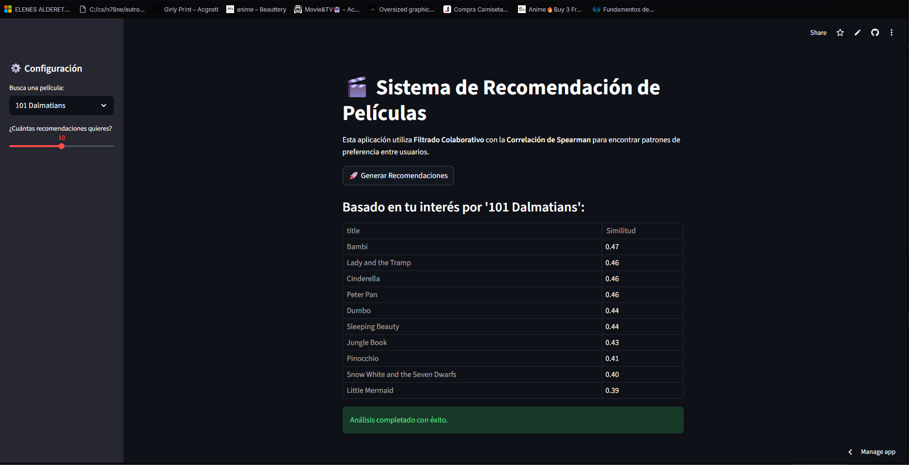

# 🎬 Movie Recommender: Collaborative Filtering & Memory Optimization

<p align="center">
  
  
  
  
</p>

---

### 🚀 [Probar la Aplicación en Vivo aquí](https://movie-recommender-udeojckruqjv8gfzz9ssbf.streamlit.app)

Este proyecto desarrolla un motor de recomendación de películas basado en **Filtrado Colaborativo**, optimizado para el despliegue en infraestructuras de recursos limitados. El sistema utiliza la **Correlación de Spearman** para identificar patrones de preferencia entre usuarios, priorizando la precisión estadística sobre datos ordinales.

---

## 🧠 Justificación Técnica

Como parte de mi enfoque en **Ciencia de Datos** y optimización algorítmica, este proyecto aborda dos retos fundamentales que demuestran rigor técnico y académico:

### 1. Rigor Estadístico: Spearman vs. Pearson
A diferencia de los enfoques tradicionales que utilizan la correlación de Pearson, este modelo implementa la **Correlación de Spearman**. 

> **¿Por qué Spearman?** Dado que los ratings de usuarios (escala 1-5) son **datos ordinales**, Spearman es superior al evaluar la relación monótona entre los rangos de preferencia. Esto permite ignorar sesgos de magnitud y falta de normalidad en las calificaciones, capturando mejor la "jerarquía" de gustos del usuario.

Formula de la Correlación de Rangos de Spearman:
$$\rho = 1 - \frac{6 \sum d_i^2}{n(n^2 - 1)}$$

### 2. Ingeniería de Datos y Optimización de Memoria
Uno de los mayores logros de este proyecto fue la gestión de la eficiencia computacional para garantizar un despliegue ligero:

* **Reducción de Huella de Memoria:** La matriz de afinidad original (pivot table densa) ocupaba aproximadamente **~600 MB**.
* **Quantization (Cuantización):** Mediante la conversión de tipos de datos de `float64` a `int8`, se logró una **reducción del 87%** en el uso de RAM, dejando el artefacto final en tan solo **73 MB**.
* **Thresholding:** Se aplicaron filtros de significancia estadística:
    * Mínimo de **1,000 ratings** por película para asegurar relevancia.
    * Mínimo de **200 ratings** por usuario para perfiles de alta densidad informativa.


---

## 🛠️ Tecnologías Utilizadas

* **Lenguaje:** `Python 3.11`
* **Análisis de Datos:** `Pandas`, `NumPy`, `SciPy` (Spearman Rank Correlation)
* **Deployment:** `Streamlit Cloud`
* **Serialización:** `Pickle` (Binary serialization)

---

## 📂 Estructura del Proyecto

```text
movie-recommender/
├── app.py              # Interfaz de usuario y lógica de recomendación.
├── requirements.txt    # Dependencias del proyecto.
├── data/               # Matriz de afinidad cuantizada (user_movie_matrix.pkl).
└── notebooks/          # ETL, análisis exploratorio y validación de modelos.
```
## 🚀 Instalación y Uso Local

Sigue estos pasos para configurar el entorno y ejecutar el recomendador en tu máquina local:

### 1. Clonar el repositorio
Obtén una copia local del proyecto utilizando Git:
```bash
git clone [https://github.com/tu-usuario/movie-recommender.git](https://github.com/tu-usuario/movie-recommender.git)
cd movie-recommender
```
### 2. Instalar dependencias
```bash
pip install -r requirements.txt
```
### 3. Lanzar aplicacion
```bash
streamlit run app.py
```



